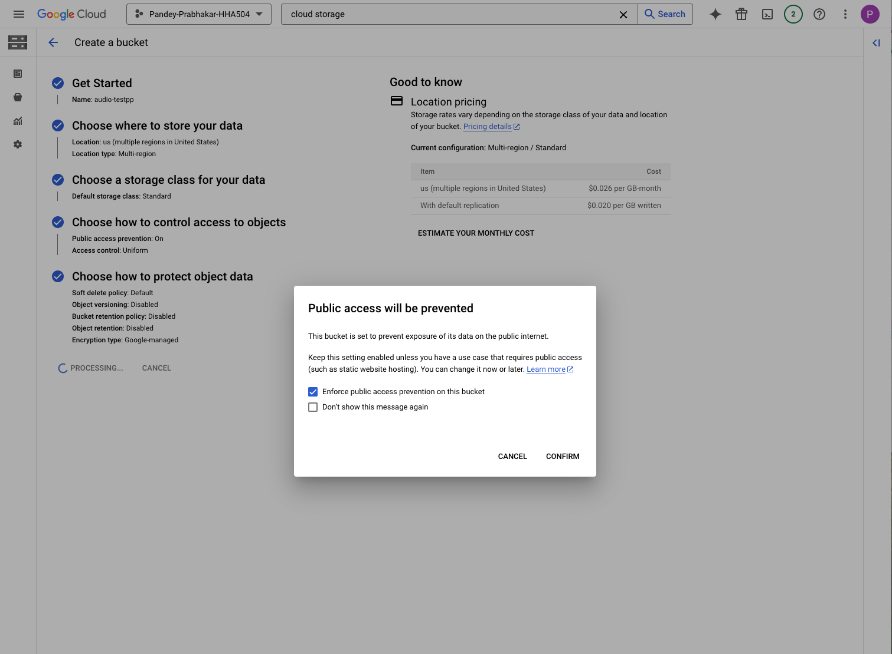

# HHA504_assignment_ai

## GCP Speech-to-Text

I kept receiving this error message when I tried to open JupyterLab. I added my audio file and image file to my bucket but was unable to get Jupyter Lab running to run my code. I kept getting a 524 error. I wasn't sure what was causing the issue. 

## Azure AI Vision

I started with a similar approach in Azure as well. I began by creating a Machine Learning workspace and created a notebook. I also had the image blob uploaded to a storage account. While I was able to launch the studio and code, I was unable to import from azure.ai.vision and kept running into an error. 

